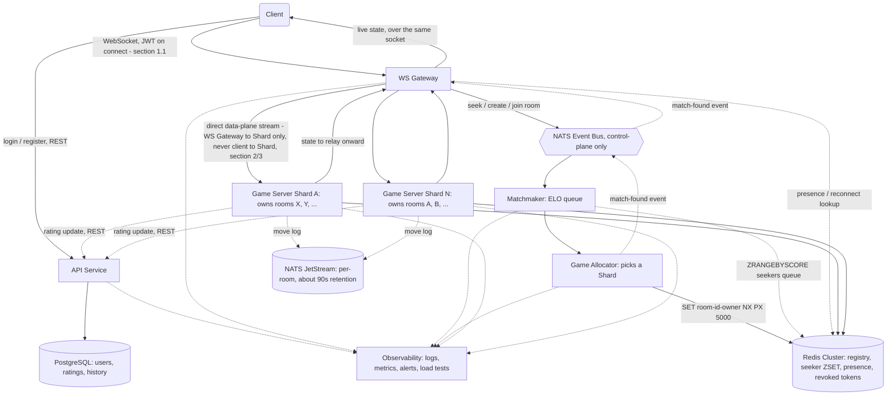
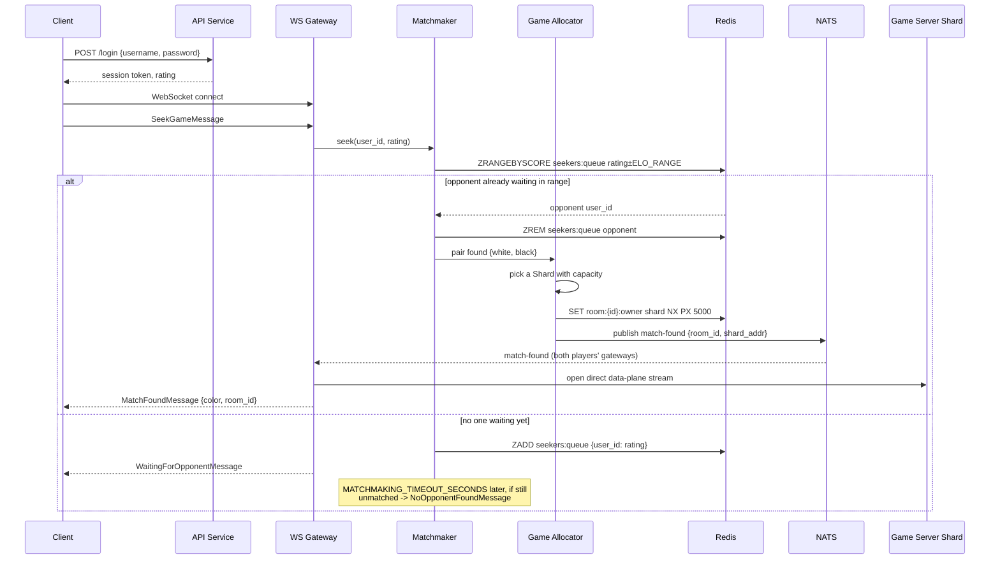
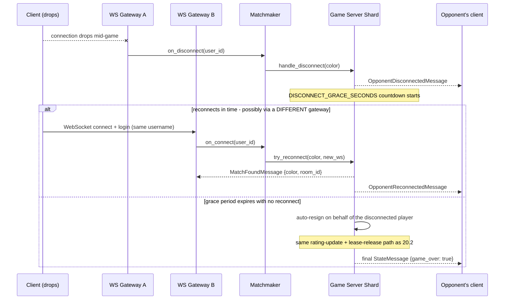
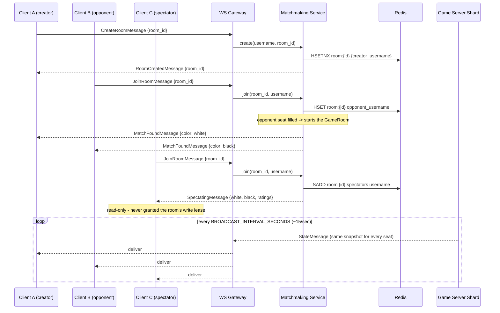
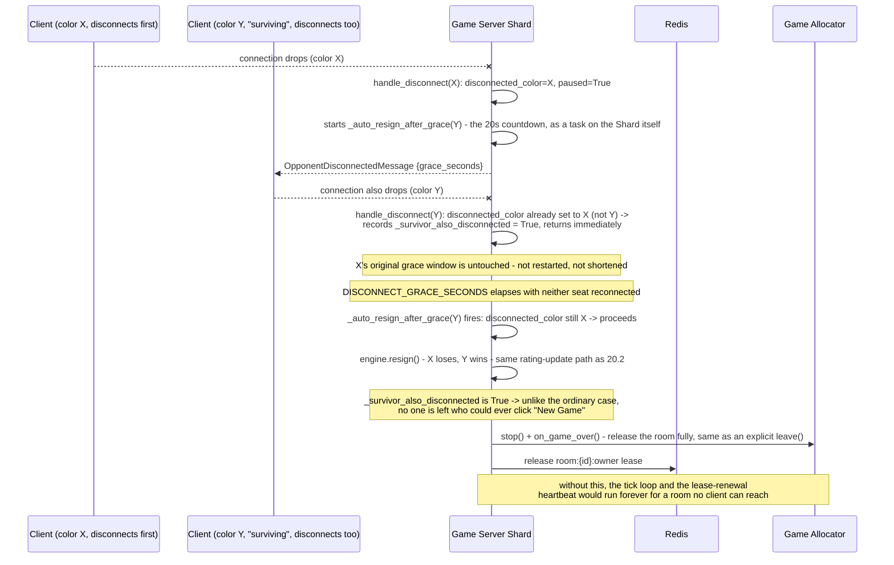
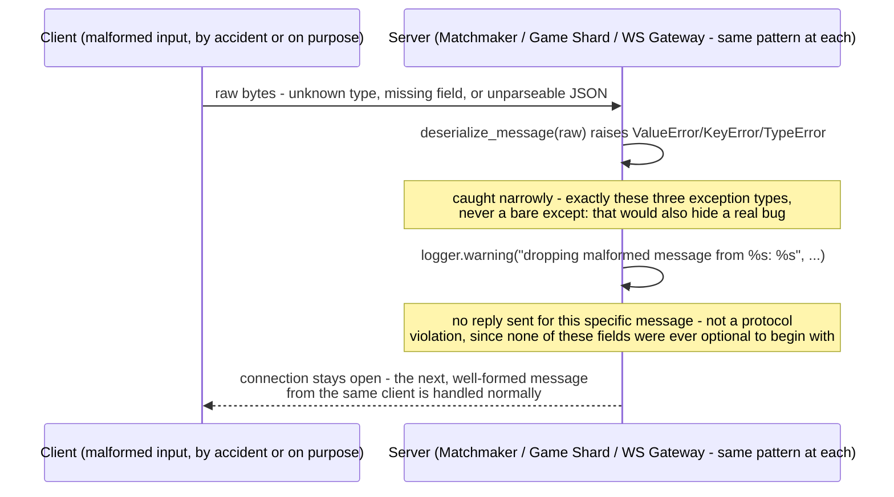

# אוקי aling Kung Fu Chess to Production Load

This document is a cloud/process-distribution design, not a class/code design - the
same architectural principles apply, but at a very different scale than the current
single-process server in `kungfu_chess/server/`. Target: **100M registered users**,
**10M concurrent players**, games averaging **30-90 seconds**.

Today's server is a single Python `asyncio` process: one in-memory `Matchmaker`
holding every waiting seeker and every active room in plain Python dicts, one
`GameRoom` asyncio task per live game, and one local SQLite file (`kfchess_users.db`)
for accounts. That design is correct for a demo and completely wrong for this scale -
everything below is about *what has to become distributed, and how the pieces talk to
each other*.

### Assumptions

Every number below that isn't taken directly from the brief (100M/10M/30-90s) is an
*educated* guess, not an invented one - each is derived from a stated number, a
comparable real system, or a named platform limit. Collected in one place, not
scattered through the sections that use them, so a reader can find and argue with any
one of them without re-deriving the whole document:

| Assumption | Basis | What breaks if wrong | How we'd find out |
|---|---|---|---|
| Avg. game lasts ~60s | Midpoint of the brief's own 30-90s range | The churn estimate (§9) and room-manager/worker-count sizing (§10) | Measure real game duration once live |
| ~500-1,000 concurrent rooms per Game-hosting worker | Within §5's low-hundreds-to-low-thousands range for the stated 4GB/process constraint | The ~10,000-worker fleet estimate (§10) scales inversely with this number | Benchmark real tick cost per room on target hardware - not yet done, see §12 |
| ~20,000 connections per WS Gateway pod | A typical per-process socket/OS-limit planning figure, not measured on this project's own hardware | The ~500-Gateway-pod estimate (§10) | Real connection-count load test per pod - not yet done |
| Players perceive ~150ms move latency as "instant" | Typical figure for real-time browser games (not measured against this project's own players) | If the true threshold is meaningfully lower, the broker-hop-on-the-hot-path decision (§2) stops being affordable | Playtest, then instrument real p95/p99 against this number in production |
| Postgres write throughput stays under one primary's ceiling until ~83,000 writes/sec | Little's Law churn estimate at 10M concurrent (§9) | Sharding (§6) becomes necessary earlier than planned | Monitor real primary write QPS in production, alert well before the trigger |
| Two simulated regions (`il`/`eu` Fleets, one physical cluster) are a sufficient stand-in to prove region-aware matching for real | This project has exactly one physical cluster/node available | The matching/placement *code path* is real and verified; actual cross-region network latency and fairness behavior remain unverified | Deploy against genuinely separate regional clusters |
| `tools/load_test.py`'s measured numbers (§10) are directionally informative, not a production capacity claim | Measured on one resource-constrained dev machine also running Agones' own control plane, Postgres, NATS, and Redis simultaneously | Production capacity per pod may differ meaningfully from the measured curve | Repeat the same tool against isolated, production-shaped hardware |

The risk direction is worth naming per row, not just the row itself: an
under-provisioned assumption (e.g. rooms-per-worker turning out lower than guessed)
fails loudly and early: performance visibly degrades. An over-provisioned one just
means paying for headroom that isn't needed yet - a safer failure mode, and one every
row above was picked to lean toward where the underlying uncertainty allowed it.

## 0. The pattern the code already follows

It's worth naming this before scaling anything: `kungfu_chess/events/bus.py`'s `Bus`
is already a small publish/subscribe system - `GameEngine` publishes move/capture
events onto it, and `MoveLogObserver`/`ScoreObserver` subscribe without either side
knowing about the other directly. That's exactly the shape a distributed system
needs: a publisher that doesn't know who's listening, and subscribers that don't know
where the publisher lives. Everything below is that same pattern, stretched across
process and machine boundaries - not a foreign concept bolted onto the project.

## 1. Which servers/processes do we need?

| Role | What it does | Talks to | Protocol | Scales on |
|---|---|---|---|---|
| **API Gateway** (stateless, many, geo-distributed) | Non-realtime entry point: login/register, room history, account-facing REST calls - no game logic | Client; Accounts service | HTTP/REST | Request rate |
| **WS Gateway** (stateless, many, geo-distributed) | Live-connection entry point: holds the player's WebSocket, forwards gameplay traffic to whichever worker owns their room - also no game logic | Client (WebSocket); Matchmaker (seek requests); the specific Game-hosting worker once matched (direct data-plane stream) | WebSocket (client-facing and worker-facing) | Open connections |
| **Matchmaker service** (a handful of instances, not one) | The "bridge between opponents" - pairs waiting players by ELO from the shared seeker queue; a pure *fairness* decision | WS Gateway; Game Allocator; Redis | HTTP/REST in from WS Gateway; publishes a low-volume "match-found" event | Queue depth |
| **Game Allocator** (a handful of instances) | A deliberately separate concern from matchmaking: given a freshly-matched pair, decides *which* Game-hosting worker has capacity to host the room, and acquires that worker's room-ownership lease (section 3) - a *placement* decision | Matchmaker; Game-hosting fleet; Redis | NATS control events | Allocation rate |
| **Game-hosting workers** (by far the most instances) | Run the real-time game loop - today's `GameRoom` logic, unchanged, just made addressable | Clients directly over WebSocket (via WS Gateway); Accounts service (rating write at game-over); NATS JetStream (durable move log - section 3) | WebSocket to clients; HTTP/REST to Accounts service; NATS for the move log | Active-room count / CPU |
| **Accounts/Ratings service** (small, few instances) | The *only* thing that talks to the SQL database directly - login, register, rating reads/writes, the final move-history summary per finished game | Postgres/MySQL cluster; called by API Gateway and by Game-hosting workers | SQL wire protocol to the DB; HTTP/REST to its callers | Request rate |
| **Redis** (shared coordination store) | Seeker queue, room-ownership registry (`room_id` -> hosting worker, leased - see section 3), presence/reconnect routing | Matchmaker, Game Allocator, WS Gateway, Game-hosting workers | Redis protocol (RESP) | Lookup/lease rate |
| **NATS** (control-plane bus, with JetStream for durable move-logging) | Low-volume events (match-found, game-finished, presence) *and*, via JetStream, a short-retention durable log of in-progress moves per room, for crash recovery (section 3) | Matchmaker, Game Allocator, Game-hosting workers | NATS / JetStream protocol | Event rate; JetStream storage (bounded - ~90s retention per room) |
| **Observability** (its own small fleet) | Logs, metrics, alerts, distributed traces, load-test tooling - not on any player's hot path, but essential for operating a fleet this size | Read-only telemetry from every other role | Metrics scrape (e.g. Prometheus) / trace export (e.g. OTLP) | Its own concern, not covered further here |
| **Orchestrator** (Kubernetes / K3s, with Agones managing the Game-hosting fleet specifically) | Starts, stops, restarts, and scales the Docker fleet; health-checks workers | Everything (control plane, not the data path) | - | - |

This directly answers what the brief asks about: the Matchmaker and the Game
Allocator are each their **own** process, deliberately, because "who should play
whom" (fairness) and "which physical worker has room for this game" (placement) are
different concerns; and "does everyone reach the same place" is exactly what the
Gateway tier (API + WS) solves - every client's first hop is one of *many*
interchangeable gateway instances, not one fixed address.

### 1.1 Auth at the edge: stateless JWT, with a Redis revocation list for the exception

Today's code has no token at all - `accounts.py` checks username/password directly
against `accounts_db.py` per call. That's fine for one process; it doesn't survive
splitting into many Gateway instances, because it would mean **every** request from
**every** Gateway round-trips to the Accounts service just to prove "this is still a
logged-in user" - turning a lightweight, stateless tier into one bottlenecked by a
service call on every single message.

**The fix**: the API Service issues a **signed JWT** at login (short-lived, containing
`user_id`, `rating`, an expiry, and a unique `jti`). Every Gateway - API or WS - holds
the *public* verification key in RAM and checks the signature and expiry **locally**,
with zero network call, on every request/connection. This is the same "stateless
fleet" property section 14.2 already establishes for the WS Gateway (no Gateway
instance holds anything that must survive its own crash) - a JWT makes *auth* stateless
the same way Redis-backed presence makes *reconnect* stateless.

The one thing a purely stateless token can't do on its own is **revocation** -
logout, a ban, or a password change should take effect immediately, not wait out the
token's own expiry. **Redis closes that gap**: one string key per token,
`SET revoked:token:<jti> 1 EX <remaining_seconds>` - not a Set with a per-member TTL
(Redis Sets have no such thing; only whole-key TTLs exist) - so a revoked entry
disappears from Redis at the exact moment it would have expired anyway (the
blacklist can never grow unbounded, it only ever holds *currently
still-valid-but-revoked* tokens). Each Gateway does one cheap
`EXISTS revoked:token:<jti>` alongside the local signature check - a single-key
existence lookup, not a full account/session fetch, and against infrastructure
(Redis) every Gateway already depends on for presence and the seeker queue, so this
adds no new moving part to the system, only a new key namespace. Implemented in
Stage 1b (section 19) as `matchmaker.py`'s `_handle_logout`.

| | Stateless-only JWT (no blacklist) | JWT + Redis revocation (chosen) |
|---|---|---|
| Per-request cost | zero network calls | one `EXISTS` (cheap, same Redis already in the hot path) |
| Logout/ban takes effect | only once the token itself expires | immediately, fleet-wide |
| New infra required | none | none - reuses the Redis cluster from section 1 |

## 2. Two kinds of traffic need two kinds of transport

Not everything above should share one pipe. Two very different traffic shapes exist:

- **Control plane** - low volume, latency-tolerant: matchmaking decisions, room
  creation, game-finished notifications, presence changes. **NATS** suits this well -
  the decoupling is valuable (a WS Gateway publishing "player wants a match" doesn't
  need to know in advance which worker will end up hosting it), and the volume is low
  enough that broker overhead is a non-issue.
- **Data plane** - high volume, latency-sensitive: the live gameplay stream itself,
  up to 15 broadcasts/sec *per active room* (today's `BROADCAST_INTERVAL_SECONDS`).
  This must be a **direct stream** from the WS Gateway to the *specific* Game-hosting
  worker that owns the room (resolved once via the room registry), not routed through
  NATS on every tick. Pushing the full gameplay volume (section 8: multiple Tbps at
  this scale, before optimization) through a general-purpose broker would make the
  broker itself the bottleneck - NATS carries the low-volume control events and the
  JetStream move log (section 3), never the raw gameplay stream itself.

**A client never has a socket to a Shard - only ever to a Gateway.** Worth stating
explicitly, since it's a real isolation requirement, not just a performance detail:
the data-plane stream above is *WS Gateway <-> Shard*, not *client <-> Shard*. The
client's only socket is to the WS Gateway; the Gateway is the sole broker that relays
each side's messages onward, resolving `room_id -> shard` via the Redis registry once
and forwarding traffic itself. A Shard is never reachable from outside the cluster's
own network - it has no public address to be reachable *at*. This already gives the
isolation an edge reverse-proxy (e.g. Nginx) would otherwise be asked to provide; a
proxy like Nginx (or a cloud L4/TLS load balancer) still has a place, but one layer
further out - in front of the *Gateway fleet itself*, doing TLS termination and
spreading incoming connections across many Gateway instances (the "Anycast Edge / LB"
layer). The two are complementary, not redundant: the edge LB decides *which Gateway*
a new connection lands on; the Gateway then decides *which Shard* that connection's
room traffic goes to. Neither layer ever hands the client a direct line to a Shard.

## 3. Room ownership: the gap a registry alone doesn't close

A `room_id -> worker` mapping in Redis is necessary but not sufficient. It tells a
new joiner *where to look*; it does not by itself guarantee that only **one** worker
ever believes it is allowed to advance a given room's simulation. Without an explicit
ownership mechanism, a rebalance or an unclean failover could leave two Game-hosting
workers both accepting moves for the same room - two disagreeing versions of the same
game.

The fix: room assignment is a **lease**, not just a registry entry -
`SET room:<id>:owner <worker-id> NX PX 5000`, renewed by heartbeat while the worker
actually holds the room, and simply left to expire on crash (no clean shutdown
required for correctness). A replacement worker can only take over once the lease has
actually expired, never by overwriting a live one. This is the distributed-scale
counterpart of what `game_room.py`'s `handle_disconnect`/`try_reconnect` and
`DISCONNECT_GRACE_SECONDS` already do for a *single* dropped socket within one
process - the lease is the same idea (a bounded grace period before someone else can
claim the seat), just applied to "which worker owns this room" instead of "which
connection owns this color."

### Recovering a crashed room without losing the game

A registry and a lease answer "who owns this room" - they don't answer what happens
to the *game itself* once that owner disappears. Simply voiding a crashed room and
sending both players back to matchmaking is the cheaper, more common choice in the
industry, and it's defensible - but it's a poor experience for the two players who
were mid-game, the same way losing an unsaved document is, regardless of how the
crash happened. Since `GameEngine`'s `RealTimeArbiter` already computes every piece's
position and cooldown as a deterministic function of *elapsed time since each move
started* - not some hidden mutable state - a crashed room's state is cheap to
reconstruct from its move history, rather than lost outright or fully replicated:
every accepted move (`MoveLoggedEvent` - already carries `elapsed_ms`) is published to
a **NATS JetStream** stream scoped to that `room_id`, with a short, bounded retention
(a room's stream only needs to outlive the room itself, at most ~90 seconds plus a
small grace window - never an ever-growing dataset). On a worker crash, the **Game
Allocator** notices (health-check plus the expiring lease), assigns a replacement
worker, and that worker replays the JetStream stream to rebuild the board and
in-flight/cooldown state before re-acquiring the lease and resuming ticking - see the
full message-by-message sequence in **section 20.5**.

**Status: the publish-and-replay mechanism itself is Done** -
`kungfu_chess/server/move_log_stream.py` publishes every accepted `MoveLoggedEvent` to
a per-room JetStream stream (`GameRoom`'s new `_JetStreamMoveLogger` observer,
game_room.py), and `GameRoom.replay()` reconstructs board/cooldown state from a
replayed history using the exact same `GameEngine.wait()`/`request_move()` primitives
ordinary play already drives - fast-forwarded instead of ticked in real time, correct
specifically because `RealTimeArbiter`'s physics is a deterministic function of
elapsed time, not of wall-clock history. `game_shard.py`'s `_build_room` checks for
prior history on every room it builds. Verified two ways: a dedicated test
(`tests/unit/test_move_log_stream.py`) that plays real moves into a live room, then
independently rebuilds a second room for the same `room_id` from nothing but replayed
JetStream history and confirms the piece positions agree - directly answering section
12's own open question ("JetStream replay correctness... not yet verified against a
real crash-and-replay test"); and a real Docker test that kills and restarts the
`game-shard` container mid-game and confirms, by querying NATS directly from a fresh
process afterward, that the move history genuinely survived the crash.

**Room-to-shard discovery: since done.** `kungfu_chess/server/room_shard_registry.py`
makes the lease's own *value* a real, dialable `host:port` (not just an opaque worker
id) - `game_allocator.py` writes it on allocation and renews it by heartbeat (the exact
`SET room:<id>:owner <worker> NX PX 5000` this section itself specifies, now doing
double duty as a genuine registry, not just mutual exclusion); `ws_gateway.py` reads it
to resolve an *existing* room_id (a reconnect or a spectator join) to whichever shard
currently owns it, instead of assuming it's always the same fixed
`SHARD_HOST`/`SHARD_PORT`. Deliberately **not** used for a *brand-new* room's
placement decision (`HostSeatMessage` still always uses the fixed address) - which
shard to place a new room on is a separate, not-yet-needed mechanism (today there's
only one candidate shard regardless - `game-shard.yaml`'s own `replicas: 1`), not the
same thing as resolving where an *already-placed* room lives. Verified with tests that
prove the dynamic path actually wins over a deliberately-wrong fixed fallback (not just
that it coincidentally matches - `tests/unit/test_ws_gateway.py`), plus a live Docker
reconnect that queries Redis directly to confirm the registry holds the real address,
not an opaque id.

**Automatic crash recovery for a live game: since done.** This section used to end here
with both halves of automatic recovery listed as deliberately unbuilt. They're built now,
and - like the Matchmaking Service work above - actually verified against a real cluster,
not just reasoned about, including one live pod-kill mid-game that surfaced two more real
bugs neither unit tests nor reasoning alone would have caught.

What changed: `room_shard_registry.py` gained a second, *durable* key alongside the
existing TTL'd ownership lease - `save_meta`/`load_meta`/`clear_meta`, storing a room's
white/black username pairing under a plain (non-expiring) key. The lease's own TTL is
exactly what makes a crashed worker's ownership disappear; this second key is what
survives that disappearance, since it's the one fact a *different* worker needs to
rebuild the pairing that a crashed worker's in-memory state would otherwise take with
it. `game_shard.py`'s `_handle_reconnect` now falls back to this when a room isn't
hosted locally: it looks up the durable pairing, re-enters the exact same "wait for the
other seat, then build the room" flow `_handle_host_seat` already had, and lets
`_build_room`'s already-existing JetStream replay (section 3, this same section) do the
actual board reconstruction - no new replay logic needed, just a new way to reach it.
`ws_gateway.py`'s relay loop now tells a Shard's own *deliberate* closes (game over, a
rejected reconnect - `ConnectionClosedOK`) apart from the process actually dying
mid-session (`ConnectionClosedError`, no close handshake at all) and, only in the latter
case, retries as a `ReconnectMessage` instead of immediately falling back to the lobby -
bounded (30 seconds across repeated attempts, not indefinite), giving a replacement
worker a real chance to finish rebuilding before giving up.

Two bugs this surfaced, both found only by killing a live pod against a real cluster
mid-game, not by reasoning about the design or by unit tests:

- `game-shard.yaml` set `SHARD_HOST=0.0.0.0` (correct for *binding* every interface)
  but never set `SHARD_ADVERTISED_ADDRESS` - which defaults to `f"{SHARD_HOST}:{SHARD_PORT}"`,
  i.e. `0.0.0.0:8767`, the literal value `room_shard_registry.py` was persisting as the
  address a *different* process should dial to reach this room. A real, pre-existing bug
  (docker-compose.yml already set this correctly; only the k8s manifest didn't) that
  simply had nothing in the whole system ever exercising this path for real until this
  stage's own automatic retry started actually dialing it.
- The retry loop's own budget (an untested guess of 3 retries × 1 second) reliably gave
  up before Kubernetes had even finished scheduling and starting a replacement pod - a
  killed pod's replacement needs several real seconds at an absolute minimum, more under
  any load, and 4 seconds of total retry budget was never going to be enough. Raised to
  20 retries × 1.5 seconds (30 seconds total, still bounded) after watching the first
  number fail against the real timing and picking one wide enough to actually cover it.

**Multi-replica placement via Agones: since done.** This section used to end with
placement of a brand-new room named as explicitly out of scope - a real, reproduced bug
(`game-shard.yaml` at `replicas: 2`): a new room's two `HostSeatMessage` relay
connections (white's and black's) are two *independent* TCP connections, each dialing
the same Service name separately, and Kubernetes' own per-connection load-balancing (no
session affinity) can and does send them to *different* replicas, leaving
`_handle_host_seat`'s own pairing wait to time out for roughly half of all matches. This
is a genuinely different shape of problem than everything else this section fixed:
those were all *one* connection needing to reach *whichever* replica already holds some
existing state (solved by making that state Redis-shared); this is *two* independent
connections that must reach the *same* replica *before* either has any state to share -
Redis-backed state alone can't decide that.

The fix: [Agones](https://agones.dev/) (`k8s/game-shard-fleet.yaml`, replacing the old
`game-shard.yaml` Deployment - deleted, see git history), a Kubernetes-native
game-server fleet manager built for exactly this "allocate me one instance, atomically,
from a pool" problem. `matchmaker.py`'s `_pair`/`_join_room` now call a new
`agones_allocation_client.py` (a plain HTTP POST to the in-cluster
`GameServerAllocation` aggregated API, authenticated with this pod's own ServiceAccount
bearer token - not the official `agones` PyPI package, which pulls in `grpcio`/
`protobuf` for four calls `aiohttp` already covers, and not Agones' separate Allocator
Service, built for callers *outside* the cluster) at the exact point both
`HostSeatMessage`s are about to be constructed - the one choke point that already holds
both usernames/connection IDs at once, so there is no second caller to coordinate with
and no new race to invent. The resolved address is written into
`room_shard_registry`'s existing lease key *before* either seat's relay connection is
opened; `ws_gateway.py`'s `_resolve_shard_address` lost its `HostSeatMessage` special
case entirely (a deletion, not an addition) and now resolves every routing message
dynamically via the registry, exactly like Reconnect/Spectate already did.
`game_allocator.py`'s `allocate()` changed from a fresh `acquire(nx=True)` to
`room_shard_registry.confirm_or_acquire()` - since the lease key may already exist
(written moments earlier by `matchmaker.py`, naming this exact replica), a plain
`acquire(nx=True)` would see "key exists" and fail every room; `confirm_or_acquire`
recognizes "the existing value is already my own address" as success, while still
refusing a *different* worker's address (the same conflict case `acquire()` always
guarded against). `game_shard.py` gained an `agones_sdk_client.py` integration - calling
the Agones SDK sidecar's `Ready()` once serving actually starts, and a periodic
`Health()` heartbeat, the same shape `game_allocator.py`'s own lease-renewal heartbeat
already used, just talking to Agones' state machine instead of Redis.

Verified against the real cluster, not just reasoned about: Agones installed via its
raw YAML manifest (Helm wasn't available in this environment; the docs call this fine
for a single evaluation cluster like this one) into `agones-system`, `game-shard`/
`game-shard-eu` Fleets (2+1 replicas - kept deliberately small, see this stage's own
resource note below) reaching `Ready` end to end. A real two-client match against the
Fleet confirmed exactly one replica's `GameServerAllocation` transitions to `Allocated`
per room (the actual regression test for the bug this exists to fix - not two half-built
rooms stuck on two replicas), and the exact same pod-kill crash-recovery test from
earlier in this section was re-run against the Agones-managed Fleet and still succeeds -
Agones' own pod-replacement timing turned out comparable enough to a bare Deployment's
that the existing 30-second/20-retry reconnect budget didn't need adjusting.

Three real bugs found only by testing against the live cluster, not by reasoning:
`agones_allocation_client.py`'s first attempt passed the ServiceAccount CA cert path as
a bare string to `aiohttp`'s `ssl=` parameter, which requires an actual `SSLContext`
(fixed with `ssl.create_default_context(cafile=...)`); the `GameServerAllocation`
response's `status.addresses` is a *mixed* list (`InternalIP`/`Hostname`/`PodIP`
entries together) and naively taking the first entry silently picks the *Node's*
address, not the allocated Pod's own - useless under `portPolicy: None`, where nothing
maps that Node address back to this specific replica; fixed by filtering for the
`PodIP`-typed entry specifically. And, unrelated to Agones itself but caught in the
course of this verification: a long-lived `game_shard.py` replica's `MoveLogStream`
(NATS) connection did not recover if the underlying NATS server itself restarted
(observed against this real cluster's own NATS pod, which had already restarted several
times from cumulative resource pressure) - the room-hosting connection silently went
stale and the next `_build_room` crashed reaching for it. Worked around at the time for
this stage's own verification by recycling the affected GameServer (Agones replaces it
cleanly, the same graceful-degradation path a genuine crash already exercises) - a real,
load-bearing example of why `save_meta`'s durable pairing plus JetStream replay (both
earlier in this section) matter even for "an ordinary process is misbehaving," not only
a hard pod-kill.

**Since fixed**, as its own focused follow-up (not bundled into the Agones work above,
since it's an orthogonal `move_log_stream.py` connection-handling gap, not a placement
one). Root cause, confirmed by reading `nats-py`'s own source: `nats.connect()`'s
default `max_reconnect_attempts=60` at `reconnect_time_wait=2s` gives a connection only
~120 seconds of total retry budget before it gives up *permanently* - once
`nats-py` considers itself closed, no amount of the server later coming back fixes it;
a brand-new connection is required. `MoveLogStream.connect()` now passes
`max_reconnect_attempts=-1` (nats-py's own "unlimited" sentinel - confirmed against its
source, not guessed) plus `disconnected_cb`/`reconnected_cb` logging, so a NATS blip is
visible in this role's own logs rather than only surfacing as a confusing crash the next
time a room happens to need this connection. The exact same reasoning
`RELAY_CRASH_MAX_RETRIES` already used earlier in this section (a retry budget sized for
an *assumption* about real infra timing, not measured against it) applied here too -
this class's own docstring already says one connection is reused for a Game Shard
replica's *entire process lifetime*, so it should never give up reconnecting on its own,
the same way the process itself doesn't restart just because NATS blipped once. Verified
against a real NATS container restart (not reasoned about): published a move, restarted
the `nats` container mid-connection, and confirmed the *same* `MoveLogStream` instance
both published a second move and replayed both afterward - the exact operation that
raised `ConnectionClosedError` before this fix.

**A resource note, given this project's own single-node dev cluster**: Fleet replica
counts (`game-shard`: 2, `game-shard-eu`: 1) are kept deliberately small - the placement
mechanism is what's being proven, not a capacity target, and this cluster has already
hit real resource pressure once before (Docker Desktop itself crashing under cumulative
load - section 19's own Stage 6 entry). Bigger replica counts would demonstrate nothing
this smaller set doesn't already prove.

**Matchmaking Service: multi-replica pairing race, since fixed.** Section 19's Stage 6
verification caught `matchmaking.yaml`'s 2-replica config intermittently failing to
pair two concurrent seekers (documented there at the time as "stays at `replicas: 1`
until that shared-state redesign happens"). That redesign is now done:
`kungfu_chess/server/matchmaker_leader.py`'s `MatchmakerLeaderElection` is the same
`SET key value NX PX ttl` lease shape as `room_shard_registry.py`'s own room-ownership
lease, just applied to "which replica currently runs the matching sweep" instead of
"which worker owns this room" - every replica still accepts `SeekGameMessage`/
`CancelSeekMessage` directly (the seekers ZSET was already Redis-shared, section 16.1),
but only the lease-holder actually decides pairs and timeouts, on a fast (0.2s) tick
(`matchmaker.py`'s `run_matching_tick`, driven by `matchmaking_service.py`'s own loop).
Investigating this surfaced a second, previously-unnoticed instance of the *same*
per-replica-local-state class of bug, one level deeper: `Matchmaker`'s other
per-connection bookkeeping (who's logged in as whom, which room a connection belongs
to, a pending reconnect's room/color, a session's token claims) was *also* still a
plain in-process dict keyed by a live `ws` object - correct only as long as every
request for one connection was guaranteed to reach the same replica, a guarantee a
Kubernetes Service load-balancing across replicas never gives. All of it moved into
Redis, keyed by `connection_id` (a plain string) instead of a live object, mirroring
the seekers queue's own approach - see `matchmaker.py`'s `__init__` for the full list
of keys. `matchmaking.yaml` is back to `replicas: 2`.

One gap remains, deliberately not solved here: a replica (chiefly the WS Gateway,
which owns the real client socket) that crashes without ever calling `/disconnect`
leaves its username's active-connection entry in Redis stale forever, permanently
refusing that username's next login. The in-process version had the *opposite*
failure mode by accident (a crashed process silently dropped its own state, with no
one else able to see it was ever stale) rather than by design - a real fix needs a
heartbeat/liveness TTL layered on top, a separate feature from the race this fix
actually targets.

**A second, genuinely separate bug, found only by actually load-testing the real
2-replica deployment (a dozen concurrent seekers, repeatedly) rather than trusting the
above redesign on its own merits**: `matchmaking_service.py`'s own HTTP route handlers
for `/message`, `/leave_relay`, and `/disconnect` looked their `_RemoteConnection` up via
a plain `connections.get(connection_id)` - returning `None`, and silently no-oping
*while still answering `200 OK`*, whenever that specific request landed on a replica
other than the one that happened to handle that connection's `/connect` call. Since a
Kubernetes Service gives no session affinity, a seeker's own `SeekGameMessage` forward
landing on the "wrong" replica meant the seek was silently dropped - not queued, not
logged, just gone, with the WS Gateway never learning anything failed (its own HTTP
call returned 200). `_RemoteConnection` carries no state of its own (just
`connection_id` and a shared Redis client), so the fix is exactly what
`_connection_for` already did for `/connect`: construct one on demand instead of
requiring a local-cache hit. Reproduced directly against the real 2-replica
deployment (roughly 1 in 6 concurrent seekers lost) and confirmed fixed the same way
(25/25 clean runs of 12 concurrent seekers afterward). A related, purely-environmental
finding along the way: `k8s/*.yaml`'s liveness/readiness probes left `timeoutSeconds`
at Kubernetes' own 1-second default, tight enough that a pod under real CPU load (e.g.
a concurrent `docker build` on the same single-node dev machine) could get SIGKILL'd
by its own liveness probe - now set explicitly to `timeoutSeconds: 5` (and a slightly
more forgiving `failureThreshold: 5` on liveness) across all four app manifests.

Two more, smaller correctness bugs turned up along the way, both genuinely unrelated
to multi-replica matchmaking itself: `matchmaking_service.py`'s own fire-and-forget
`asyncio.create_task(...)` for publishing a match's routing signal kept no reference to
the task it created - a task with nothing else referencing it is eligible for garbage
collection before it ever runs (a documented, if easy-to-miss, `asyncio.create_task`
pitfall), which could silently drop the publish; fixed by keeping every such task in a
module-level set until its own done-callback fires. And `game_room.py`'s
`_apply_rating_update` guarded against double-applying with a plain boolean flag set
*before* its own DB round trips - correct for preventing a double-apply, but it let a
concurrent caller (the periodic broadcast tick, which also checks for an already-over
game) see "already applied" and proceed to send the game-over `StateMessage` before the
update had actually finished writing, occasionally letting an immediate reconnect read
a stale rating; fixed with an `asyncio.Lock` around the whole check-and-apply, so a
concurrent caller waits for the in-flight update instead of skipping past it.

- This was weighed against a **paired hot-standby worker** (mirroring every room live
  onto a second process, so failover is instant with no replay at all) and rejected
  for cost: that would roughly double the entire Game-hosting fleet's footprint,
  forever, to shave a brief, bounded replay gap down to near-zero - a poor trade for
  a 30-90 second casual match. JetStream replay costs almost nothing extra per
  worker (the durable copy lives in the JetStream cluster, not duplicated on every
  worker) at the price of a short, bounded reconnect gap instead of a seamless one.
- Postgres still only ever receives the **final** move-history summary once a game
  actually ends (matching section 9's ~83,000 writes/sec) - it was never a candidate
  for the *live* log itself: at 10M concurrent players moving roughly every 2
  seconds, that's on the order of 5,000,000 move-events/sec system-wide, far beyond
  what a relational database is built to sustain as a continuous write stream.
  JetStream, an append-only log by design, is the right tool for that volume;
  Postgres is the right tool for the durable, low-frequency summary.

## 4. "Open a Docker per game" vs. pooling many games in one process

**Open a Docker when a game starts, close it when the game ends** is a real,
legitimate pattern (this is how dedicated-game-server fleets like Agones-on-Kubernetes
actually work). It gives clean isolation (one game's crash can't touch another's) and
simple, natural autoscaling (ask the orchestrator for more pods as the queue grows).

The real cost is **container cold-start latency**: booting a brand-new container from
scratch for every match is a meaningful chunk of a 30-90 second game, and (section 9)
happens roughly 83,000 times a second at target scale - far too often to cold-start.
The fix is a **warm pool** - the orchestrator keeps some idle, already-started
containers on standby; "opening a Docker" for a game means *assigning* one from the
pool, not booting one from zero.

The alternative - today's actual code's model, many `GameRoom`s ticking as asyncio
tasks inside one long-lived process - is also valid, and is in fact what a
Game-hosting *worker* (section 1) does internally: one process, one Docker container,
many concurrent rooms. Both models are a density/isolation trade-off; either way, the
capacity math below decides how many worker processes you actually need.

## 5. How many games fit in one process? (the 4GB constraint)

**Memory**: one active game's Python-side footprint (board, pieces, rule engine,
arbiter, move-log/score observers, plus two socket buffers) is roughly 0.5-1MB,
generously rounded. A 4GB process, leaving headroom for the interpreter itself and a
safety margin, could in principle hold on the order of a couple thousand such games by
memory alone.

**But CPU - not memory - is the tighter bound in practice.** One Python process
shares one CPU core's worth of execution (the GIL): `GameRoom._run` is a sequential
tick loop, and a process doesn't get faster by giving it more cores, only by running
more copies of it. Every active game also broadcasts a board snapshot 15 times a
second, and that snapshot is real work to serialize (measured directly from this
codebase: **~5.6KB of JSON per snapshot** - see section 8). JSON-encoding that
15x/sec, multiplied across however many games share one process, adds up well before
memory does. The honest answer is that the practical games-per-process number is an
empirical tuning question to benchmark, not a clean formula - landing somewhere in the
low hundreds to low thousands depending on tuning. The point to take away: **the 4GB
figure alone is not the binding constraint - CPU is**, so the design is "many worker
processes, ideally about one per CPU core, each capped by measured throughput," not
"one huge 4GB process."

By Little's Law, 10M concurrent players at 2 players/game means **5M concurrent
games**; even an optimistic 1,000 games/worker means **5,000 Game-hosting worker
processes** running at once, globally, simultaneously.

## 6. Question 1 - a DB for 100M registered users; is SQLite enough?

**No** - and not because of row count. 100M account rows (username, salt, password
hash, rating) is on the order of tens of GB, trivial for any relational database. The
actual problem is architectural:

- SQLite is a **single local file with one writer and no network protocol** - it
  cannot be safely shared across many separate worker/Docker processes running on
  many different machines. There's no way for a Game-hosting worker in one
  datacenter to reach a SQLite file sitting on disk in another, and even on one
  machine, concurrent writers contend for the same file.
- It has **no built-in replication, sharding, or failover** - one crash takes the
  whole dataset down.

**Recommendation**: a replicated relational database (PostgreSQL or MySQL), reachable
**only** through the Accounts service from section 1 - never directly from thousands
of ephemeral Game-hosting workers. That bounds the number of live DB connections to a
small, controlled set regardless of how large the worker fleet grows, and keeps the
one piece of data that genuinely needs strong consistency (unique usernames, correct
password checks, atomic rating updates) behind one well-defined choke point. Shard by
`user_id` hash (e.g. Citus/Vitess) if write throughput - not storage - ever becomes the
limit; section 9's ~83,000 rating-writes/sec is exactly the number that would force
that decision. Presence, the seeker queue, and the room-ownership lease (section 3)
deliberately do **not** live here - that ephemeral, extremely high-churn data belongs
in Redis, not a relational DB.

**Status: Done.** `accounts_db.py` talks to Postgres via `psycopg2` - a fresh
connection per call, the same simplicity level the old `sqlite3.connect(db_path)`-per-
call code already had; connection pooling is a real optimization but a separate
concern from *which* database this talks to, deliberately left for later rather than
bundled into this migration. `accounts_service.py` remains the only process that
touches it directly (unchanged from Stage 1); since `psycopg2` is a blocking driver,
its handlers now run each DB call via `run_in_executor` so one slow query stalls only
the request awaiting it, not every other concurrent request the same event loop is
serving - the first genuinely new failure mode this migration introduced, since a
blocking local SQLite call never stalled other requests noticeably. Every
`accounts.py`/`accounts_db.py` function's first argument is now a Postgres **schema**
name, not a file path - always `"public"` in production, a fresh throwaway schema per
test (`tests/unit/conftest.py`'s `db_path` fixture, `CREATE SCHEMA`/`DROP SCHEMA
CASCADE`) for the same real-isolation reason a fresh SQLite file per test used to
serve. `docker-compose.yml` gains a `postgres` service with a named volume (survives
`docker compose down`, not `down -v`). One real, measured consequence worth naming:
network round trips to Postgres are meaningfully slower than local SQLite file access
was, enough that two already-existing timing-sensitive tests in `test_game_room.py`
(auto-resign after a disconnect grace period, which itself does a rating-update round
trip) needed their sleep buffers widened to stay reliably green - not a correctness
regression, just this migration's most direct, empirical illustration of exactly the
kind of latency section 8 discusses in a different context. Sharding by `user_id`
hash and MySQL-as-an-alternative remain unimplemented, left as explicitly future work
per this section's own scaling trigger (~83,000 writes/sec) - not yet reached by
anything this codebase actually drives.

**Read/write ratio for the one entity that matters here - a player's rating**: a
rating is *read* at login, at every match-found screen (both seats' ratings shown to
each other), and every spectate join (again both seats) - several read touchpoints
per player-session. It's *written* exactly once per completed game, for exactly the
two players in that specific game. An honest order-of-magnitude estimate, not a
measured figure (see the Assumptions table above): comfortably read-heavy, likely
10:1 or higher. That ratio is exactly why a read replica (below) is the right tool
here and why it targets `fetch_rating` specifically - caching and replicas both work
well precisely because reads dominate this lopsidedly. Contrast the *other* kind of
state this design handles, live board state (section 8): written and read by the two
participants at roughly 1:1, where neither a cache nor a replica would help at all -
which is exactly why that state lives in Redis/in-process memory instead of here,
not a database at any ratio.

**Read replica: since done** (not sharding - this project's real data volume, per
this section's own opening line, was never the actual problem sharding solves).
`k8s/postgres.yaml` now runs a genuine streaming replica alongside the primary: a
dedicated `replicator` role (`REPLICATION LOGIN` only, not the `kfchess` superuser -
least-privilege for a new network-facing connection) plus a permanent physical
replication slot, both created via the primary's own
`docker-entrypoint-initdb.d/` scripts - including the one line the vanilla
`postgres:16-alpine` image's own default `pg_hba.conf` does *not* write
(`host replication replicator all scram-sha-256` - the image's default
`host all all all` line explicitly does not authorize a replication connection,
the single most likely silent-failure point here). The replica's own PVC starts
empty, so its bootstrap can't go through `docker-entrypoint-initdb.d/` (that only
ever runs `initdb` against a genuinely empty dir, not a real base backup) - an init
container runs `pg_basebackup --write-recovery-conf` first, idempotent via checking
for `standby.signal`'s presence (written only after a base backup fully completes)
before deciding whether to (re)run; the main container's own entrypoint is
completely unmodified vanilla behavior, which - seeing a non-empty, already
version-stamped data directory - skips `initdb` and just execs `postgres`, which
finds `standby.signal` and starts in standby/recovery mode on its own (PG16's own
mechanism, replacing the `recovery.conf` file removed in PG12).

`accounts_db.py` gained a `POSTGRES_REPLICA_DSN` (defaults back to the primary DSN
when unset - a safe no-op for docker-compose/the test suite, neither of which runs a
replica) and a `_connect(schema, read_only=False)` parameter; only `fetch_rating`
(a high-frequency, standalone read, never part of a read-then-write transaction)
passes `read_only=True`. `fetch_user` (login/register) and `fetch_ratings` (always
paired with `write_ratings` in the same logical update) deliberately stay on the
primary - a replica's own replication lag could otherwise hand back a rating older
than what the immediately-following write is about to overwrite. No manifest change
was needed for `k8s/api.yaml` - it already pulls every key from the shared
`postgres-credentials` Secret, so the new `POSTGRES_REPLICA_DSN` key reaches the
`api` pods automatically.

Verified against the real cluster: `pg_stat_replication` on the primary shows
`state = streaming` for the replica; a rating updated on the primary is readable
from the replica moments later. One genuine migration wrinkle worth naming since it
surprised nothing but is easy to get wrong: `docker-entrypoint-initdb.d/` scripts
only ever run once, against a truly empty data directory - the existing primary's
PVC (already holding real rows from this project's own accumulated testing) had to
be deleted and recreated for the new init scripts to actually take effect, since
mounting them changes nothing retroactively for an already-initialized database.

## 7. Question 2 - 10M concurrent players: routing, "everyone plays everyone", any room from anywhere

**One server is nowhere close to enough**, for two independent reasons: no single
process can hold 10M sockets, and - separately - no single Python process can run
5M rooms' worth of tick computation on one core regardless of socket count.

"Everyone can play with everyone, and anyone can join any room" works because no
client ever needs to know which physical machine anything lives on - see the full
login -> seek -> match message sequence in **section 20.1**. The short version: any
**API Gateway** handles login (no game logic); any **WS Gateway** holds the live
socket and forwards a seek request to the Matchmaker, which sees every waiting player
*globally* (the shared Redis-backed queue - section 1), not just players on this one
Gateway - unlike today's single-process `Matchmaker._waiting` dict, which only ever
sees seekers connected to it. Once matched, the **Game Allocator** (deliberately a
separate service, since "who should play whom" and "which worker has room" are
different concerns) picks an available Game-hosting worker, acquires its
room-ownership lease (section 3), and publishes a low-volume `match-found`
control-plane event carrying `{room_id, worker_address}` back to both players' WS
Gateways, which each open the direct, high-frequency **data-plane** stream (section 2)
to that specific worker. **Join Room** for an arbitrary `room_id` works identically:
any WS Gateway looks up the current owner in the room registry and opens the same
kind of stream (full sequence in **section 20.4**) - a spectator does the same, just
without ever being granted the write lease.

To be precise about what "who's on which server" actually means, since it's easy to
conflate three different things: a player's **Gateway connection** is incidental and
stateless (any Gateway works, nothing about it needs to be recorded per-player); the
**shared seeker queue** (Redis) only holds a player while they're waiting to be
matched; **room ownership** (the lease from section 3) is the one mapping that
actually matters for "who's on which server," and it only comes into existence the
instant a match happens - not at login.

### Failure modes (explicitly required by the brief)

| Component fails | Effect | Recovery |
|---|---|---|
| A Game-hosting worker/Docker dies mid-game | Both clients lose their socket at the same instant; the crashing worker's own in-memory state is gone | Orchestrator health-check plus the expiring room lease (section 3) tell the Game Allocator the worker is gone; it assigns a replacement worker per affected room, which **replays that room's NATS JetStream move log** (section 3) to reconstruct the board and re-acquires the lease - both WS Gateways redirect to the new worker. A short, bounded reconnect gap (at most ~90 seconds' worth of moves to replay, typically far less) - the game continues instead of being voided |
| A Matchmaker instance dies | No data is lost - the seeker queue and room registry live in Redis, not in that instance's own memory (unlike today's single-process dict) | Orchestrator restarts it; the replacement resumes serving the same shared queue immediately |
| Redis dies | The most serious failure, since everything above depends on it | Redis Cluster/Sentinel with replication; already-*running* games are unaffected (they only need their own two sockets) - only *new* matchmaking/room-joins pause fleet-wide until it recovers |
| The Accounts DB dies | New logins/registrations fail | Already-running games are unaffected until their game-over rating write, which should be buffered/retried (a small outbox via the control-plane broker) rather than silently lost; mitigate with a replicated, multi-availability-zone DB with automatic failover |

**On geography and resilience**: it's tempting to think "host everything in one
especially stable, secure location" - but the real answer is the opposite: no single
location, however stable, should be trusted to never fail (power, fire, a cut fiber
line, or worse). The Redis clustering and multi-availability-zone DB failover above
already assume this - they exist specifically so the system survives losing an
*entire physical location*, not just a single machine. Game-hosting workers
themselves should run across multiple regions for the same reason, with Gateways
routing each player to their nearest healthy region.

**Naming the reference scenario explicitly, per component**: every piece of state in
this design answers the same underlying question - reconstruct after failure, or
accept losing it? - and the answer genuinely differs by component, worth stating
plainly rather than leaving implicit. For live game/board state, the reference
scenario is *"a crashed room should recover, not vanish"* (section 3's JetStream
replay) - affordable to build because the physics is a deterministic function of
time and move history, and because retention only ever needs to cover a single
~90-second game, not a growing dataset. For ratings/account data, the reference
scenario is stricter still - *"an update must never be silently lost"* - hence the
buffered/retried write and the replicated DB; a wrong or missing rating update has
no cheap recovery path the way a board position does. A **paired hot-standby
worker** (mirroring every room live onto a second process, so failover is instant
with no replay at all) was also considered and rejected here specifically for cost:
it would roughly double the Game-hosting fleet's footprint, forever, to shave a
brief, bounded replay gap down to near-zero - a poor trade for a 30-90 second casual
match.

**Region-aware matchmaking: since done**, answering this section's own open question
above ("Matchmaking could bias toward same-region pairing, falling back to
cross-region only when the local ELO pool is too thin"). `SeekGameMessage` gained a
`region` field (defaults to `protocol.DEFAULT_REGION`, so every existing client/test
that constructs one bare keeps matching exactly as before); `matchmaker.py`'s
`_sweep_matches` now partitions the rating-sorted seekers queue by each seeker's own
region (order-preserving, so each group stays rating-sorted on its own) and runs the
existing adjacent-pairing scan once per region group first - same-region bias -
before combining every group's leftovers, re-sorting by rating, and running the
*same* pairing scan once more as the cross-region fallback pass. No new pairing
algorithm - the existing linear scan (extracted into `_pair_within`), just called
twice on different subsets. The matched room's region (white's own - the same
"creator/first seat is white" convention this codebase already uses elsewhere, for
a cross-region match where the two sides disagree) feeds directly into the Agones
allocation call above as the Fleet selector, tying the two features together: which
*region* a room belongs to and which *Fleet* Agones allocates it from are the same
decision, made once, at match time.

Genuinely simulated, not claimed as real: this project has exactly one physical
cluster/node, so `game-shard`/`game-shard-eu` are two Fleets on the same machine, not
two actual locations. The code path itself - region grouping, fallback, and the Fleet
selector it drives - is real and would work unchanged against genuinely separate
regional clusters later; only the Fleets' physical placement would need to change.
Two simulated regions, not more, deliberately: enough to prove the same-region-first/
cross-region-fallback mechanism for real without adding replica counts this
single-node cluster can't comfortably carry (see section 3's own resource note).
Verified against the real cluster: three seekers, two sharing a region and mutually
in ELO range with the third - the two same-region seekers matched each other, landing
on the correct Fleet (confirmed via each `GameServerAllocation`'s own
`agones.dev/fleet` label), leaving the third still waiting rather than being paired
cross-region prematurely; a separate two-seeker, same-region-on-the-other-side check
confirmed the second Fleet is reachable the same way.

**What region-aware matching does *not* address: fairness within a cross-region
match.** Same-region bias reduces *how often* two geographically distant players get
matched at all - it does nothing for the ones who still are, via the fallback pass.
Worth being explicit about this rather than letting the region work above read as a
complete answer to the fairness question: two players on opposite sides of a real
future multi-region deployment, paired by the fallback pass, would each get a
different one-way latency to whichever Fleet Agones allocates the room from (today,
moot - both simulated regions are the same physical node) - the closer one reacts
first, purely from geography, regardless of skill. The fix this document names but
doesn't build is **lag equalization**: deliberately holding the closer player's
inputs by the latency gap between the two, so both see the same effective delay -
a genuinely counter-intuitive move (adding latency on purpose to improve the system),
and one that only makes sense once "minimize latency" is replaced with "keep it
bounded *and* symmetric" as the actual objective for a competitive, player-vs-player
system. Not implemented here: it has no effect to measure against one physical
cluster, and doing it honestly needs the real per-region round-trip numbers a genuine
multi-region deployment would provide - exactly the kind of assumption this
document's own Assumptions table (above) exists to flag rather than quietly build
against a placeholder number.

## 8. Question 3 - network traffic for one active player (~1 move every 2 seconds)

**Latency budget: ~150ms**, not "as fast as possible" - the figure above which a
player actually notices a move feels delayed, per the Assumptions table above (a
typical real-time-browser-game figure, not yet measured against this project's own
players). Every hop below is worth judging as a *percentage of that budget*, not
against zero: a single in-datacenter broker hop (the Redis Pub/Sub match-found signal,
§2) is on the order of low single-digit milliseconds - a few percent of the budget,
not a cost that changes any decision in this document. What the number actually
disqualifies is a *chain* of several such hops on the same hot path, or anything that
adds tens of milliseconds per player - which is exactly why the move-relay path itself
(this section) stays a direct socket, not a broker hop, while the low-volume
match-found/timeout signaling (§2) can afford one.

Client -> server per move is tiny: a click message is about 40-60 bytes of JSON
(`{"type": "select_or_move", "row": r, "col": c}`) - negligible even at one every
couple of seconds.

The real cost is the **server -> client state broadcast** - and reading the actual
running code changes the answer here. Today's implementation resends the *entire*
board as JSON at a fixed 15 times/second, regardless of whether anything changed.
Measured directly against the real code (a full starting-position board, serialized
exactly the way `game_room.py` sends it): **~5.6KB per `StateMessage` snapshot.**

| Scenario | Basis | Downstream per player | Fleet-wide at 10M concurrent |
|---|---|---|---|
| Literal premise (each player's own move only, ~150B message, naive) | 1 move/2s × ~150B | ~75 B/s | ~6 Gbps |
| **Current code, unmodified, measured** | 5.6KB × 15/sec | ~84 KB/s | ~6.7 Tbps |
| Target design: sparse move-start event + client-side interpolation | both seats move -> ~1 event/sec visible per player × ~150-250B | ~150-250 B/s | ~12-20 Gbps |

The current design is **not viable at all** at this scale - no realistic
infrastructure absorbs several terabits of egress from one logical service, for a
game whose actual information content is one integer move roughly every two seconds.
More Dockers alone would not fix this - it would just spread 6.7 Tbps across more
machines, not shrink it. The fix has to be a protocol change: send a sparse event only
when a piece starts moving (`from`, `to`, `duration_ms` - a piece can't have two
concurrent motions, so `from` alone is already a unique key, no separate piece id
needed) and let the client animate between events itself, the same way
`renderer.py`'s `BoardView.lerp_pixel` already interpolates a piece's on-screen
position between `position` and `target_position` given a `progress` value - the
change is *where `progress` gets computed*: from local elapsed time on the client
(new), not resent by the server on every tick (the old behavior; correcting an
earlier draft of this section, which claimed the client-side computation already
existed - it didn't, until this stage was actually built). **Status: implemented**
(section 19's Stage 4b) - `kungfu_chess/client/motion_tracker.py`'s
`apply_pending_motions` is exactly this client-side computation, and
`BROADCAST_INTERVAL_SECONDS` (`game_room.py`) now covers only the slower periodic
resync (cooldowns, scores, move log), not piece motion itself.

**A second, smaller stream**: section 3's JetStream move log adds its own write
volume, separate from all of the player-facing traffic above - since it's written
once per move rather than multiplied by however many recipients see it, it's roughly
5,000,000 moves/sec system-wide x ~150-250B ≈ **~6-10 Gbps** into the JetStream
cluster - the same order of magnitude as the fixed target-design row above, and
comfortably within what a purpose-built append-only log is designed to sustain
(unlike writing that same volume directly into Postgres).

## 9. Question 4 - games last 30-90 seconds; what does that mean for Docker roles?

By Little's Law: 5,000,000 concurrent games ÷ ~60s average lifetime implies:

```
5,000,000 games / 60s ≈ 83,000 games starting - and ending - every second, globally
```

That's continuous churn, not a one-time cost, with concrete consequences:

- **Matchmaking tier** must sustain ~83,000 match-and-create decisions per second,
  continuously, forever - favoring many small, horizontally-sharded matchmaker
  instances (partitioned by rating band and/or region) over one central matchmaker
  like today's single `Matchmaker` class.
- **Game-hosting tier** reinforces section 4's warm-pool conclusion: at this churn
  rate, cold-starting a container per match is untenable; rooms need to be cheap to
  spin up and tear down, whether that's "assign from a warm pool" or "start one more
  asyncio task inside an already-running worker."
- **Accounts service** sees a matching ~83,000 rating-update writes/sec sustained,
  globally - reinforcing section 6's answer that this write path needs a dedicated,
  horizontally-scalable service, not a single SQLite file. Note this scales
  differently from every stateless tier above: the Accounts *service* itself can run
  as more identical instances, but the *database* behind it scales via
  **replication** (a primary plus synced replicas) - not by running more unrelated
  copies of it the way a stateless worker scales.
- **Rolling deploys/scale-down become cheap**: a Game-hosting worker being retired
  just stops accepting new rooms and drains its existing ones (bounded, ≤90s wait)
  before exiting - no live-migration machinery needed, unlike a service with
  hours-long sessions.
- **Bounded replay cost**: the same short game length driving the conclusions above
  also caps how much a crashed room's replacement worker ever needs to replay
  (section 3) - at most ~90 seconds' worth of moves, typically far less.

One upside worth naming explicitly: because games are so short-lived, the system
**rebalances fast** - an overloaded Game-hosting worker fully drains within about a
minute as its current games finish, so autoscaling can be far more responsive here
than for a genre with hour-long matches.

## 10. Does the capacity actually add up?

Treating the numbers above as planning assumptions to validate, not measurements yet:

- Assume a conservative ~500 concurrent rooms per Game-hosting worker (well inside
  section 5's low-hundreds-to-low-thousands range).
- **Bandwidth per worker** (target design, section 8): 500 rooms x ~1 event/2s x
  ~200B x 2 seats ≈ trivial - well under 1 Mbps, negligible against any node's
  network allocation.
- **Workers needed at peak**: 5,000,000 games / 500 = **~10,000 Game-hosting worker
  processes**.
- **New-room rate per worker**: 83,000 / 10,000 ≈ ~8.3 rooms/sec/worker - cheap, since
  starting a room is just an in-memory allocation (`GameRoom.__init__` today has no
  I/O in its hot path).
- **Gateway tier, independently**: 10,000,000 connections / ~20,000/pod ≈ **~500
  Gateway pods**.

Ten thousand worker processes sounds large in isolation, but it is the expected,
direct consequence of the scale being asked for - the point of this design is that no
single component needs to be huge; it needs to be replicated a lot.

**Real measured numbers, since done** - replacing pure estimation with an actual data
point, though a narrowly-scoped one (see the honesty note below). `tools/load_test.py`
is a real, checked-in, reusable tool (not a scratch script - same asyncio/`websockets`
style as this session's own verification scripts, generalized): it drives N simulated
player pairs concurrently through register → seek → match → a few moves → disconnect
against a real running Gateway, and reports p50/p95/p99 latency for time-to-match and
move round-trip. Run against this project's own single-node dev cluster at increasing
concurrency:

| Concurrent pairs | Login p50 | Time-to-match p50 (p99) | Move round-trip p50 (p99) |
|---|---|---|---|
| 3 | 328ms | 531ms (547ms) | 16ms (16ms) |
| 20 | 187ms | 391ms (703ms) | 16ms (234ms) |
| 50 | 406ms | 2,140ms (3,860ms) | 32ms (734ms) |
| 100 | 1,156ms | 5,016ms (6,813ms) | 125ms (1,172ms) |

**Read honestly, not as a production capacity claim**: these numbers come from one
resource-constrained single-node Docker Desktop dev machine, running every role of
this stack (including the Agones control plane) at once, sharing the same CPU the
tool itself runs on to generate load - the visible latency growth from 3→100 pairs is
at least as much this shared node saturating as it is anything about the
architecture's own scalability. What it *does* genuinely replace is pure guesswork:
section 9's ~83,000 matches/sec and ~10,000-worker estimates remain unmeasured
planning numbers (this tool measures latency under a given concurrency, not
throughput ceiling or per-worker capacity), but "does the whole pipeline actually
work under real concurrent load, and by how much does latency degrade as it grows" is
now an answered, reproducible question instead of an assumed one.

## 11. Why this meets the requirements

1. **100M registered users** - a replicated Postgres/MySQL cluster behind a single
   Accounts service (section 6) comfortably handles the data volume; SQLite is ruled
   out for architectural reasons (single writer, no network protocol), not size.
2. **10M concurrent players, routing, shared rooms, role division** - a split
   API/WS Gateway tier, a Redis-backed Matchmaker paired with a separate Game
   Allocator (fairness and placement kept as distinct concerns), leased room
   ownership with JetStream-based crash recovery, and a ~10,000-worker Game-hosting
   fleet (sections 1-3, 7, 10) - with explicit failure handling for every tier,
   including a crashed room recovering rather than vanishing.
3. **Network traffic at ~1 move/2s** - measured directly from the real code (~84
   KB/s/player, ~6.7 Tbps fleet-wide unmodified) and identified as the top
   optimization target, with a concrete fix that reuses the client's existing
   interpolation logic (section 8).
4. **30-90 second games** - ~83,000 games/sec of churn (Little's Law) drives the
   warm-pool design, sharded matchmaking, and a dedicated write-scalable ratings path
   (section 9).

## 12. Open questions

- **Cross-region latency and matchmaking bias: since answered for the matching/
  placement mechanism** (section 7/section 3) - same-region pairing is biased for,
  falling back to cross-region only when the local pool is thin, and the decided
  region drives Agones Fleet placement directly. What remains genuinely open: this
  is verified against two *simulated* regions on one physical cluster, not real
  inter-region network latency - the actual "what does the losing side's latency
  cost" question needs a real multi-region deployment to answer for real.
- **Reconnect routing across regions**: a disconnected client must be able to find its
  room again through *any* Gateway, not just the one that held the original socket -
  works by construction here (the room registry is globally reachable), but needs
  verification under real failover timing.
- **NATS capacity, two different shapes**: the low-volume control events (~83,000
  match-found/game-finished/sec plus presence churn) need sizing, and separately -
  at a very different scale - so does the JetStream move-log stream (~6-10 Gbps,
  section 8). Both are estimates, not measurements; worth a real load test on each.
  (`tools/load_test.py`, section 10, measures match/move latency under load, not
  NATS throughput specifically - this remains a distinct, unmeasured question.)
- **JetStream replay correctness under real load**: the replay math (section 3)
  assumes `RealTimeArbiter`'s position/cooldown logic can be run forward from
  recorded timestamps with no drift - reasonable given how it's built today, but not
  yet verified against a real crash-and-replay test.
- **Games-per-worker (~500-1,000) and connections-per-Gateway (~20,000)** are planning
  numbers, not measurements - `tools/load_test.py` (section 10) is a first real step
  (measured match/move latency under concurrency, on this project's own dev
  hardware), but benchmarking actual tick cost and socket overhead per worker at the
  numbers this section names is still real future work, not yet done.

## 13. From six logical components to four deployable units

Everything above answers *why* to distribute; this section and the ones that follow
answer *how to actually package it* - concretely, as Docker images this codebase can
be built into. The project brief lists six logical components (API Gateway, WebSocket
Gateway, Matchmaker, Game Allocator, Game Server Shards, Observability) plus a
recommended stack (NATS/Redis PubSub, Redis, PostgreSQL, Docker Compose, K8s/K3s). A
logical component is not automatically its own container - the right grouping
question is: **do these components share the same exposure surface and the same
scaling profile?** Combine when yes; keep separate when they differ in protocol,
statefulness, or blast radius.

Today's actual code is one process, one event loop: auth (`accounts.py` ->
`accounts_db.py` -> `kfchess_users.db`), the `Matchmaker` (in-memory, and today the
one that *also* creates `GameRoom` directly - fused matching+allocation), and every
`GameRoom`'s tick loop are all just concurrent tasks in that one process. Section 15
below diagrams the target this splits into; the state that matters for splitting it
up (`_waiting`, `_rooms`, `_active_connections`, `RoomRegistry`) is keyed by a live
`ServerConnection` object in memory, not by an opaque id (`user_id`/`room_id`) -
that's exactly what has to change before any of this can be split across processes.

| Rule | Applied here |
|---|---|
| Bundle services with the same exposure (protocol) and the same scaling profile | Login/Rooms(REST)/Rating are all plain REST, stateless, backed by Postgres - they'd scale identically (more replicas behind a load balancer) |
| Keep separate anything that differs in protocol / statefulness / blast radius | WebSocket is a stateful, long-lived connection (scales on connection count, not QPS); a Game Server Shard holds live state in memory and its crash only affects the rooms it hosts |
| Cross-cutting infrastructure is not a "service" at all | Observability is never its own application container - it's Prometheus/Grafana/logs reading telemetry from everything else |

**Result: 6 logical components -> 4 deployable units + Observability as infra:**

1. **API Service** = Auth + Rooms(REST) + Rating/History -> one Docker image
2. **Matchmaking Service** = Matchmaker + Game Allocator -> one Docker image
3. **WS Gateway** -> stays separate (different protocol/statefulness)
4. **Game Server Shards** -> stays separate (blast radius, holds live state)
5. **Observability** -> infra, not an application container

### 13.1 The real grouping criterion is "same required infrastructure," not just "same layer"

A sharper version of the rule above: two components are worth bundling not just
because they're logically similar, but because they need the **same
infrastructure/dependencies (the same `pip install`) and the same "level" of protocol
exposure**. If two components both need Redis and NATS at the same level, and their
dependency sets are identical, the only real difference between them is *which
endpoint gets called* (e.g. `/room` vs. `/calculation`) - and at that point bundling
them is an economic decision, not just a logical one. This is exactly the case for
Matchmaker + Game Allocator: both need Redis and NATS, both are lightweight and
non-realtime from the client's point of view - they belong in the same deployable
unit not merely because they're sequential steps in one pipeline, but because they'd
need identical infrastructure regardless.

### 13.2 Separate pure logic from its transport adapter (ports & adapters)

The existing code already demonstrates the right shape for this: `accounts.py` is
pure logic (password hashing, ELO math, `AuthResult`) with zero knowledge of how it's
reached - `server.py` happens to wrap it in a WebSocket call today, but it could just
as easily be wrapped in an HTTP handler without changing a single line of the logic
itself. **This is the principle to apply to all four deployable units**: internal
decisions (`"are these two players an ELO match?"`, `"which worker has room?"`)
should always be plain functions with no idea whether they were invoked from an HTTP
handler, a NATS subscriber, or a unit test. Each deployable unit is *pure logic* +
one or more thin *adapters* (a REST adapter, a NATS adapter) wrapping it - which also
keeps the door open to wrapping the same logic in a different protocol later without
touching it.

## 14. Mapping current code to deployable units

| # | Logical component (brief) | Deployable unit | Protocol | Scales on | Current code that moves there |
|---|---|---|---|---|---|
| 1 | API Gateway (login/rooms/history) | **API Service** | HTTP/REST | request rate | `accounts.py` + `accounts_db.py` - almost 1:1, already networking-free and takes `db_path` as a parameter |
| 5 (part) | Rating/History | **API Service** (same unit) | HTTP/REST | request rate | part of `accounts.py` (`update_ratings_after_game`) - the call moves from `game_room.py` writing the DB directly to an internal HTTP call to the API Service |
| 2 | WebSocket Gateway | **WS Gateway** | WebSocket | open-connection count | `server.py` (`_handle_connection`, `serve(...)`) - just the socket acceptance; auth logic moves to the API Service, the gateway only routes |
| 3 | Matchmaker | **Matchmaking Service** | internal (NATS/HTTP) | queue depth | `matchmaker.py` - the `_waiting`/`_find_opponent_within_elo_range` part (fairness/ELO only) |
| 4 | Game Allocator | **Matchmaking Service** (same unit) | internal (NATS) | allocation rate | `matchmaker.py` - the part that today **instantiates `GameRoom` directly** (`_start_seeking`, `_join_room`) - exactly the placement decision that needs to become its own responsibility inside the same unit |
| - | Room Registry (Create/Join) | Redis, owned by the Matchmaking Service | Redis protocol | - | `rooms.py` (`RoomRegistry`, `Room`) - already pure, I/O-free logic; moves almost as-is into a Redis schema |
| 5 | Game Server Shards | **Game Server Shards** | WebSocket (data-plane from the Gateway) | active-room count / CPU | `game_room.py` (`GameRoom`) + `kungfu_chess/engine/*` - the game logic itself barely changes; only *who* it sends to/receives from changes (never the client directly, always a stream the WS Gateway routes) |
| 6 | Observability | separate infra, not an application container | Prometheus scrape / OTLP | - | doesn't exist yet - added as logging/metrics in every unit |
| - | Wire protocol | shared library imported by all four units | - | - | `protocol.py`, `messages.py`, `serialization.py` - unchanged in shape, just becomes a package shared across units |

### 14.1 Scope of a Game Server Shard: only the "live game" window

Worth stating explicitly: a Shard is responsible for neither the administrative start
nor the administrative end of a game - only the window during which it's *live*:

- **Game start** (deciding which worker hosts it, acquiring the lease) -> the **Game
  Allocator**'s job (inside the Matchmaking Service), *before* the Shard has even
  heard of the room.
- **The live game itself** (tick loop, accepting moves, broadcasting) -> the **Game
  Server Shard**'s job alone - exactly what `GameRoom._run` already does today.
- **Game end** (rating update, DB write, releasing the lease, clearing the room
  registry entry) -> split between the Shard (releases its lease, requests the rating
  update) and the **API Service** (which actually performs the Postgres write - the
  one DB choke point from section 6).

The Shard is deliberately a "thin in time" layer - it enters the picture only after
allocation and exits it the instant the game ends, with no knowledge of what happens
before or after.

### 14.2 WS Gateway: stateful per connection, stateless as a fleet

A question worth answering explicitly: should the Gateway be stateless? It depends on
which level you're looking at. A **single connection** is inherently stateful - a
live TCP/WebSocket socket exists for as long as the player is connected. But **the
fleet as a whole** can and should be stateless: no specific Gateway instance "owns" a
given player - if a connection drops, the player can reconnect through *any* other
Gateway instance, because reconnect/presence mapping lives in Redis, not in that
Gateway process's own memory. This is the same point made in section 7 ("a player's
Gateway connection is incidental and stateless") - the thing to verify at
implementation time is that no data structure inside the Gateway's own code holds
anything that needs to survive that specific instance crashing.

## 15. End-to-end flow of the target architecture

Mermaid flowchart - renders natively on GitHub and in any Mermaid-aware viewer, no
plugin needed:



Step by step:

1. **Login**: the client calls the **API Service** (REST) for login/register ->
   reads/writes PostgreSQL, gets back a signed **JWT** (section 1.1), not a bare
   session id.
2. **Live connection**: the client opens a WebSocket against the **WS Gateway** (not
   the API Service - different protocol, different scaling axis), presenting the JWT;
   the Gateway verifies it locally (signature + expiry + Redis revocation check),
   with no call to the API Service.
3. **Seeking a match**: clicking "Play" -> the WS Gateway forwards a seek request to
   the **Matchmaking Service**. Its internal `Matchmaker` looks at the shared queue in
   Redis (not a local dict, as today) and finds an ELO-appropriate opponent.
4. **Allocation**: once paired, the `Matchmaker` hands the decision to the `Game
   Allocator` (**same deployable unit**, separate responsibility in code) - it picks
   an available Game Server Shard, acquires its lease in Redis
   (`SET room:<id>:owner <worker> NX PX 5000`), and publishes a `match-found` event on
   NATS.
5. **The game itself**: the WS Gateway, having heard the event, opens the direct
   data-plane stream to the specific assigned Shard on the client's behalf - **the
   client's own socket stays pointed at the Gateway the whole time** (section 2/3);
   this hop is **not through NATS**, since the volume is too high (sections 2 and 8).
   The Shard runs
   `GameEngine`/`RealTimeArbiter` exactly as it does today.
6. **Game end**: the Shard sends a rating-update request to the API Service (an
   internal HTTP call, not a direct DB write as today) and releases its Redis lease.
7. **Observability** reads metrics/logs from all four units throughout - never part of
   any player's request path.

For the exact message-by-message sequence of each individual scenario this diagram
summarizes (login+match, a move and game end, disconnect/reconnect, rooms, crash
recovery), see **section 20**.

## 16. Two concrete infrastructure decisions

### 16.1 The matchmaking queue must be a Redis ZSET, not a linear scan

Today, `matchmaker.py`'s `_find_opponent_within_elo_range` (line 216) loops over
**every** waiting player (`self._waiting.values()`) until it finds one inside the ELO
range - O(n) per match attempt. The right Redis structure is a **ZSET** (sorted set):
`ZADD seekers:queue <rating> <user_id>` on entering the queue, then finding candidates
in-range via `ZRANGEBYSCORE seekers:queue <rating-100> <rating+100>` - a logarithmic
range query (`O(log n + m)`, where `m` is the number of results in range) instead of a
scan over the whole queue. Worth locking in now, as part of moving the seeker queue
from an in-memory dict to Redis (roadmap stage 0, section 19).

### 16.2 NATS vs. Redis Pub/Sub for the control plane

The brief lists "NATS / Redis PubSub" as two options for the control plane - a real
decision worth making explicit rather than leaving implicit:

| | Redis Pub/Sub | NATS (+ JetStream) |
|---|---|---|
| Extra infra to run | none - Redis is already required anyway | a separate system (extra Docker/ops cost) |
| Durability | **none** - a message to a subscriber that isn't currently connected is simply lost | JetStream retains a durable log for a bounded time, replayable |
| Where we actually need durability | - | the move log for crashed-room recovery (section 3) - **required**, not a nice-to-have |
| Complexity | very simple, no extra API to learn | a dedicated API, but richer capacity/routing too |

**Recommendation**: use NATS+JetStream as the brief suggests, specifically because
crashed-room recovery genuinely needs durability that Redis Pub/Sub cannot provide.
That said, if the immediate goal is only a **local Docker Compose** for development,
without crash recovery yet, it's reasonable to start with Redis Pub/Sub for the
lightweight control events (match-found, game-ended) to save one infra piece in the
early roadmap stages, and add NATS+JetStream only once crashed-room recovery is
actually implemented. This is an intentionally open decision, not a settled one.

## 17. Docker packaging: one image with roles, vs. one Dockerfile per unit

Section 13's four deployable units don't necessarily mean four separate `Dockerfile`s.
Since all four units share the same codebase (Python, the same
`protocol.py`/`messages.py`, largely overlapping pip dependencies), two packaging
strategies are both legitimate:

| Strategy | How it works | Pro | Con |
|---|---|---|---|
| **A. A separate Dockerfile per unit** (4 images) | each unit is its own container, with only the dependencies it actually needs | small, precise image per role, full build isolation | 4 files to maintain, 4 build pipelines |
| **B. One Docker image, "role" chosen at run time** | a single `Dockerfile` installs every dependency; the role (`api` / `ws-gateway` / `matchmaking` / `game-shard`) is chosen by an entrypoint argument or `SERVICE_ROLE` env var - all four entries in `docker-compose.yml` share the same `image:`/`build:`, differing only in `command:`/`environment:` | one Dockerfile to maintain, guaranteed dependency-version consistency across units (no drift between images), fewer CI pipelines | a somewhat larger image (bundles dependencies only some roles use) |

**Recommendation**: start with **strategy B** (one image, roles chosen at run time) -
this both matches the observation that the `pip install` set is nearly identical
across units and that the real difference between them is just *which endpoint gets
hit*, and it doesn't compromise anything about scaling: `docker-compose.yml` (and
later Kubernetes) still runs four separate `services:`/`Deployments` from that one
image, each with its own replica count and autoscaling metric - exactly as it would
with four separate images, just built from one `Dockerfile`. If a specific role (e.g.
Game Server Shard) later needs a heavy, unique dependency the other roles don't - that
is the natural point to split *that one role* into its own Dockerfile, without
touching the rest.

## 18. Kubernetes vs. K3s: which orchestrator, and when

Section 17 decided how to *package* the four deployable units; this section decides
what actually *runs* them as a cluster, once docker-compose on one box isn't enough.
Two real options:

| | Full Kubernetes | K3s |
|---|---|---|
| What it is | The standard orchestrator (what a managed EKS/GKE/AKS runs under the hood) | A CNCF-certified, lightweight K8s distribution (Rancher) - one ~50MB binary |
| API / manifests | Full API surface | **Identical** API, same manifests, same `kubectl` - just a stripped-down control plane (SQLite instead of etcd by default, no legacy in-tree cloud drivers) |
| Control-plane weight | Heavy: etcd, API server, scheduler, controller-manager - meant to run HA across multiple machines itself | Runs on a single small VM; much lower resource overhead |
| Ecosystem | Mature: HPA autoscaling, service mesh, cloud load-balancer integration, secrets management | Same ecosystem is available, just not bundled by default |
| Migration cost later | - | API-compatible with full K8s - moving up is a lift-and-shift, not a rewrite |
| Fits when | Genuine multi-node/multi-region scale (section 7's per-region repeated stack), or a managed cluster where someone else operates the control plane | Developing or running this at small-to-medium scale, self-hosted, want the option to graduate later without redoing manifests |

**Recommendation for this project**: start with **K3s** (roadmap stage 6, section 19)
- the four deployable units plus Redis, NATS, and Postgres run comfortably on it during
development and even a real but modest deployment, and every manifest written against
it stays valid if the project ever needs to graduate to full K8s for genuine
multi-region scale (section 7). Reach for **Agones** specifically for the Game Server
Shard fleet (the Orchestrator row in section 1) once shard lifecycle management
(ready/allocated/draining, section 4's warm-pool point) outgrows plain Deployment/
ReplicaSet semantics - this applies the same whether the cluster underneath is K3s or
full K8s, since Agones runs on both; it isn't a reason by itself to pick one over the
other.

### 18.1 Why a message broker *and* an orchestrator - they solve different problems

Worth naming explicitly why this design already uses **both** NATS/JetStream
(section 16.2) and K3s/Agones (above), rather than treating that as two unrelated
line items: they answer two different questions, and neither substitutes for the
other.

- **The broker (NATS, or Kafka in the more general case) answers "how does a
  message get from a writer to a reader without either knowing about the
  other?"** - it's a queue with durability: it holds `match-found`/`game-finished`
  events, and the per-room move log, between the process that produced them and
  whatever process eventually consumes them, however long that takes. Queue
  *depth* - how many messages are waiting - is a real, measurable signal of load
  (section 1's Matchmaker/Game Allocator both scale "on queue depth").
- **The orchestrator (K3s/Kubernetes) answers "how many copies of that consumer
  should be running right now, and where?"** - it doesn't touch the messages
  themselves; it watches signals like queue depth (or CPU, or active-room count)
  and adds or removes *identical, interchangeable* worker instances in response.
  No individual Matchmaker or Game-hosting worker instance has - or needs - an
  identity of its own; the same way a single ant doesn't matter to an ant colony
  but the colony's overall behavior does, no single instance matters here, only
  the fleet's aggregate capacity.

Put together: **a growing queue in NATS is the signal, and Kubernetes scaling out
more consumer pods is the response** - the broker alone would just let unprocessed
messages pile up forever, and the orchestrator alone would have nothing
load-based to scale *on* without a queue-depth (or equivalent) signal to read.
This is exactly why section 1 lists "queue depth" and "allocation rate" as the
scaling metric for the Matchmaker and Game Allocator specifically, rather than a
generic CPU threshold - the queue is the number Kubernetes' autoscaler actually
watches.

## 19. Staged implementation roadmap

Suggested stages for actually building this (each stage leaves the system working).
Status reflects the actual code/git history as of this writing, not just the plan:

1. **Stage 0 - Done** (`3972d75`): Redis added as a dependency; the seeker queue and
   `RoomRegistry` moved from in-memory dicts to Redis (ZSET-backed queue, section
   16.1) - `kungfu_chess/server/redis_client.py`.
2. **Stage 1 - Done** (`461ea55`): `accounts.py`/`accounts_db.py` split into a
   standalone API Service (`accounts_service.py`); the rest of the system calls it
   over HTTP (`accounts_client.py`) instead of importing it directly.
   - **Stage 1b - Done**: JWT issuance (`kungfu_chess/server/auth_token.py`) at
     login/register, local signature+expiry verification at the Gateway (no
     Accounts Service round-trip for a `TokenLoginMessage`), and Redis-backed
     revocation (`matchmaker.py`'s `_handle_logout`, section 1.1) - plus the
     client-facing features that give it an actual purpose: a "Continue as X"
     saved-session login (`kungfu_chess/client/token_store.py`) and a real
     **Logout** button in the lobby.
3. **Stage 2 - Done** (`ec00217`): socket acceptance itself split out of `server.py`
   into `kungfu_chess/server/ws_gateway.py`, talking to the rest of the system over
   Redis/HTTP (still one process at this stage).
4. **Stage 3 - Done** (`fbed6bc`, hardened by `20d0ff3`): `matchmaker.py` split into
   its two responsibilities - `matchmaker.py` (fairness) and
   `kungfu_chess/server/game_allocator.py` (placement) - with lease-based room
   ownership in Redis. `20d0ff3` closed the gap section 20.6 documents: a room whose
   both occupants vanish before the auto-resign timer fires now fully releases
   itself (and the Allocator's lease-renewal heartbeat), instead of running forever.
5. **Stage 4** splits into two parts, done in this order deliberately (the leaner
   wire protocol from 4b simplifies whatever transport 4a's process-split needs):
   - **Stage 4b - Done**: replaced the full-snapshot broadcast (~5.6KB @ 15/sec)
     with the sparse-event protocol (section 8) - `PieceMotionStartedMessage`
     pushed immediately on move-start, `BROADCAST_INTERVAL_SECONDS` slowed to a
     periodic resync for everything else, plus two latency fixes the slowdown
     otherwise would have caused (an immediate personalized send on selection,
     and an immediate full snapshot on reconnect - `game_room.py`,
     `client/motion_tracker.py`).
   - **Stage 4a - Done** (`dc90bdc`, same commit as 4b): `game_room.py`'s logic
     now runs in a standalone `kungfu_chess/server/game_shard.py` process,
     reached only by the WS Gateway's relay connections over
     `shard_protocol.py` - never a real client socket directly, and no more
     shared in-process `ServerConnection` objects. `matchmaker.py` no longer
     constructs a `GameRoom`; it fires an `on_enter_relay` signal and
     `ws_gateway.py` switches the connection into a raw byte-pipe relay to the
     Shard, covering ELO matching, Room Create/Join, spectators, and
     cross-process reconnect (verified end-to-end over real sockets in
     `tests/unit/test_relay_integration.py`).
6. **Stage 5 - Done**: one image, role chosen via `SERVICE_ROLE` (`Dockerfile`,
   `docker_entrypoint.py`), plus a `docker-compose.yml` running all **4** roles
   alongside Redis - `api` (`accounts_service.py`), `ws-gateway` (`ws_gateway.py`),
   `game-shard` (`game_shard.py`), and now `matchmaking` (`matchmaking_service.py`),
   each with its own `main()`/root launcher script. The 4th unit closes the gap
   an earlier draft of this entry flagged: `matchmaker.py` itself needed **zero**
   logic changes to become network-reachable - it already only ever calls
   `.send()`/`.close()` on whatever connection-like object it's handed (proven by
   `test_matchmaker.py`'s own `FakeConnection`, which needed no changes either),
   so `matchmaking_service.py`'s `_RemoteConnection` is simply a second
   implementation of that same informal port, publishing over Redis instead of
   writing to a live socket. Transport (section 16.2): **HTTP** for anything that
   is a direct reply to the request that triggered it, and **Redis Pub/Sub - not
   NATS** - for the two things that are never a reply to the caller's own request
   (signaling a match/room-seat to the *other*, already-waiting player; the
   seek-timeout's `NO_OPPONENT_FOUND`, fired by an internal timer with no request
   to reply to at all). NATS was deliberately not introduced *for this*, even
   though it was later added for JetStream/crash-recovery (section 3): the two
   are separate decisions made at separate times, for separate reasons - this
   Pub/Sub traffic never needed durability, so it never needed NATS.
   `ws_gateway.py`'s per-connection `relay_queues` dict is gone, replaced by a
   Redis Pub/Sub channel scoped to a per-connection id it generates itself.
   One documented deviation from section 14's mapping table survives this stage
   unresolved: `GameAllocator` still lives inside `game_shard.py`, not alongside
   `Matchmaker` in the Matchmaking Service - a Stage 4a decision (placement
   physically follows the room it allocates, not the fairness decision that
   preceded it), left as-is rather than re-litigated as a side effect of this
   stage. NATS and Postgres joined `docker-compose.yml` in later commits, once
   JetStream crash-recovery (section 3) and the Postgres migration (section 6)
   actually landed - not as part of this stage.
7. **Stage 6 - Done**: Prometheus metrics on every role
   (`kungfu_chess/server/metrics.py`, one `/metrics` HTTP endpoint per role via
   `prometheus_client.start_http_server`, doubling as each role's Docker/K8s
   health check), each reporting the exact scaling metric section 1's own table
   already names for that role - request rate (`api`), open connections
   (`ws-gateway`), queue depth (`matchmaking`), active-room count
   (`game-shard`) - not a generic, undifferentiated pile of counters. Prometheus
   + Grafana added to `docker-compose.yml`; the same roles translated into
   `k8s/` manifests (Deployments/Services/PVCs/a Secret for Postgres
   credentials), targeting K3s per section 18's own recommendation (identical
   API/manifests to full Kubernetes, so these apply unchanged to a managed
   cluster too - see `k8s/README.md`).

   Verified twice, not just written: the observability stack end-to-end in
   Docker Compose (all 4 app roles' Prometheus targets `up`, real traffic
   reflected in `api_requests_total`/`matchmaking_matches_made_total`, Grafana
   reachable), and the full `k8s/` manifest set actually deployed to a live
   cluster (Docker Desktop's own Kubernetes) - not just schema-validated,
   since `kubectl`'s dry-run in this environment still needs a reachable API
   server to check anything against. That real deployment caught a genuine
   bug no amount of static review would have: Kubernetes auto-injects
   Docker-links-style env vars for every Service in a namespace
   (`REDIS_PORT=tcp://<ip>:6379`), colliding with this project's own
   same-named env vars - fixed with `enableServiceLinks: false` on every app
   Deployment. It also caught a second, more interesting bug: `matchmaking.yaml`
   originally requested 2 replicas (matching queue depth as ws-gateway's own
   named scaling metric), which intermittently failed to pair two concurrent
   seekers - `matchmaker.py`'s `_waiting` dict is local, in-memory,
   per-process state (the live `_RemoteConnection` handle a match needs to
   signal), not something Redis's shared seekers ZSET actually replicates
   across replicas; a seeker connected through one replica is invisible to
   another replica's own attempt to pair with them. `game-shard.yaml`'s own
   comment already named this exact class of limitation for the Shard fleet;
   this is the same limitation surfacing in the Matchmaking Service instead -
   `matchmaking.yaml` was pinned to `replicas: 1` until that shared-state
   redesign happened, documented in the manifest itself, not silently
   worked around. **Since fixed** - see section 3's own "Matchmaking Service:
   multi-replica pairing race, since fixed" for the redesign and
   `matchmaking.yaml`'s current `replicas: 2`.

8. **Stage 7 - Done**: the four items this design still named as open/deferred,
   closed in one pass - Agones-based Game Shard placement (section 3), region-aware
   matchmaking (section 7), a genuine Postgres streaming read replica (section 6),
   and a real load-testing tool with measured numbers (section 10). Each verified
   against the real cluster, not just reasoned about or unit-tested, in the same
   style every prior stage above used - including three more real bugs found only by
   that live testing (an `aiohttp` SSL-context type error, a mixed-address-list
   parsing bug, and a pre-existing NATS-reconnection gap in `move_log_stream.py` -
   all three since fixed, all detailed in section 3, the last one verified against a
   real NATS container restart, not just reasoned about). Session-level resource care
   worth naming plainly: this stage's own
   Fleet replica counts were kept intentionally small (2+1, not larger) given this
   project's one physical dev machine had already hit real resource limits once
   before (Stage 6's own Docker Desktop crash, above) - proving the mechanism, not
   maximizing replica count, was always the actual goal.

Verification at each stage: `python -m pytest` should keep passing, and two client
processes (`python app.py` run twice) should still be able to connect, get matched,
and play a game to completion - the same manual check `README.md` already describes.

## 20. Scenario flows (sequence diagrams)

Sections 3, 7, and 15 above establish *why* each piece exists and *what* it's
responsible for; this section is the concrete "what actually happens, message by
message" for every scenario a player can hit - a diagram answers that more clearly
than prose does, so this section leans on Mermaid sequence diagrams almost
exclusively, with only as much surrounding text as a diagram itself can't carry
(mainly, *why* a step happens, not what it is).

### 20.1 Login -> Seek -> Match found



### 20.2 A move, and the end of the game

```mermaid
sequenceDiagram
    participant C1 as Client (mover)
    participant C2 as Client (opponent)
    participant WSG as WS Gateway
    participant S as Game Server Shard
    participant API as API Service
    participant DB as PostgreSQL
    participant R as Redis

    C1->>WSG: SelectOrMoveMessage {row, col}
    WSG->>S: forward (direct data-plane stream)
    S->>S: RuleEngine validates; RealTimeArbiter schedules the move

    loop every BROADCAST_INTERVAL_SECONDS (~15/sec)
        S-->>WSG: StateMessage (personalized snapshot)
        WSG-->>C1: deliver
        WSG-->>C2: deliver
    end

    Note over S: king captured, resign, or auto-resign
    S->>S: GameEngine marks the game over
    S->>API: POST /games/{room_id}/result {winner, loser}
    API->>DB: update ELO ratings
    API-->>S: ack
    S->>R: release room:{id}:owner lease
    S-->>WSG: final StateMessage {game_over: true}
    WSG-->>C1: deliver
    WSG-->>C2: deliver
```

### 20.3 Disconnect -> Reconnect within the grace period

The "reconnects via a different gateway" branch is the concrete reason a player's
Gateway connection has to stay stateless (section 14.2) - nothing about routing back
to the right Shard depends on which Gateway instance the player happens to land on.



### 20.4 Room Create -> Join -> Spectate -> broadcast

A spectator is anyone past the second joiner of a room - the third and every
subsequent `JoinRoomMessage` for the same `room_id` lands in
`room:{id}:spectators` instead of taking a player seat, and is handed a
`SpectatingMessage` instead of a `MatchFoundMessage`: same room, no write lease.
Once seated, a spectator receives **exactly the same `StateMessage` broadcast
stream** as the two players (today's 15/sec full-snapshot tick, section 8) - the
Shard does not distinguish spectators from players when broadcasting, it simply
fans the same message out to every connection registered on the room. That is the
simplest correct behavior and the one to build first.



**Open question, not yet a decision**: a popular room's spectator count is
unbounded in principle (a losing side effect of "anyone can join any room" -
section 7), while player count per room is always exactly two - so spectator
fan-out, not player traffic, is the actual scaling risk for this scenario. The
option considered and **deliberately deferred**: a separate, one-way, batched
feed for spectators specifically (e.g. Server-Sent Events at a few-hundred-ms
interval instead of the full 15Hz `StateMessage`), decoupling spectator load
from player load entirely. Worth revisiting once (or if) a room's spectator
count is actually measured to be large enough to matter - not before, since it
adds a second delivery pipeline (and a second thing to keep consistent with the
game state) for a cost that is currently only hypothetical.

### 20.5 Game-hosting worker crash -> JetStream replay recovery

The scenario section 3 argues for at length - this is the same recovery, as a
sequence.

```mermaid
sequenceDiagram
    participant S1 as Game Server Shard (crashes)
    participant Orch as Orchestrator
    participant GA as Game Allocator
    participant R as Redis
    participant J as NATS JetStream
    participant S2 as Game Server Shard (replacement)
    participant WSG as WS Gateway

    Note over S1: process crashes mid-game
    Note over R: room:{id}:owner lease (PX 5000) is not renewed - it expires
    Orch->>GA: health-check failure for S1
    GA->>R: confirms the lease has expired
    GA->>GA: picks a replacement Shard (S2)

    S2->>J: replay room.{id} move log
    J-->>S2: STARTING_POSITION + every MoveLoggedEvent, in order, with elapsed_ms
    S2->>S2: rebuild the board; recompute in-flight/cooldown state from those timestamps
    S2->>R: SET room:{id}:owner S2 (acquires the lease)
    GA->>WSG: room {id} is now owned by S2
    WSG->>S2: reopen the direct data-plane stream
    Note over S2,WSG: ticking resumes - the game continues, not voided
```

### 20.6 Both players disconnect before the grace timer fires

`DISCONNECT_GRACE_SECONDS` (section 20.3) is "who runs the 20 seconds" made
concrete: the **Shard itself** owns that countdown, as a plain `asyncio` task
living inside the room (`_auto_resign_after_grace`) - there is no separate
timer service, because the Shard is already the one long-lived process for that
room's whole life (section 14.1). This scenario is the gap a live bug-fix closed
(`20d0ff3`): the *ordinary* 20.3 flow assumes one player disconnects while the
other stays around to either wait or click "New Game" - it does not, by itself,
say what should happen if that **second** player also disappears before the
timer fires. Before this fix, the second disconnect was silently ignored, the
timer still auto-resigned the game for rating purposes, but never released the
room itself - leaving the Shard's tick loop, and (since Stage 3) the Game
Allocator's lease-renewal heartbeat for it, running forever for a room nobody
could ever come back to.



The ordinary case (20.3) - one player still present, might reconnect or start a
new game - is untouched by this fix; only the double-disconnect path changes.

### 20.7 A deliberately malformed or malicious message

The flow every other scenario above assumes away: a client (a broken build, or someone
poking the WebSocket directly, not just the real UI) sends something the server never
would - an unknown `type`, a payload missing a required field, or a wire format that
doesn't parse as JSON at all. Never trusted just because a UI would have blocked it
(the UI is not a boundary the server controls) - so this is the flow that actually
proves the gatekeeper, not just declares one. The same pattern repeats at every
message-boundary in this design (`matchmaker.py`, `game_shard.py`, `ws_gateway.py`),
so one diagram stands for all three:



The gatekeeper is the same three-line pattern at all three boundaries, on purpose -
not because copy-paste was easier, but because it's genuinely the same problem
(untrusted bytes crossing a process boundary) with the same correct answer, and having
it duplicated three times where each server role receives client-originated bytes
independently is more honest than routing all inbound traffic through one shared
choke point it doesn't otherwise need. What this flow deliberately does **not** do is
disconnect the client for sending one bad message - a genuinely malicious client gets
no signal that it succeeded or failed differently from a client that just hit a
transient bug, and a real bug on the client side gets a chance to self-correct on its
very next message rather than being kicked out for one bad frame.
